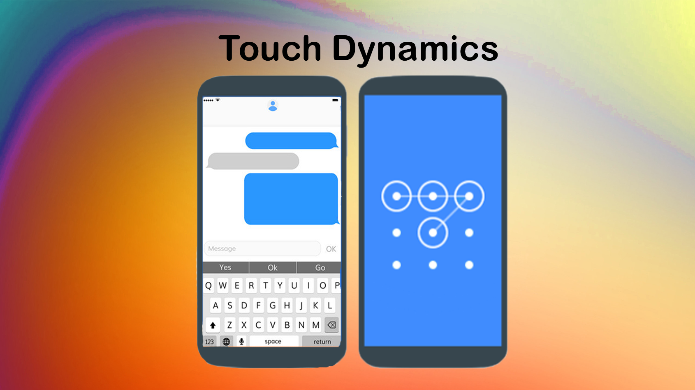
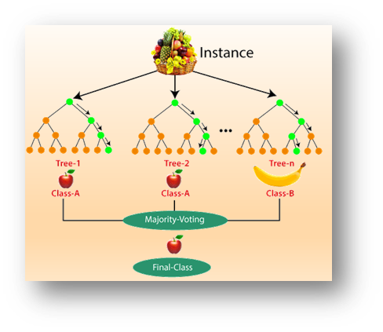
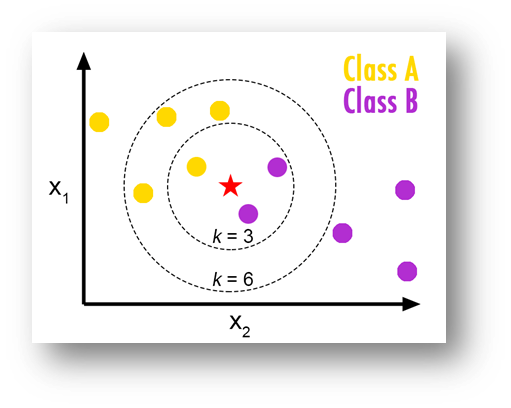
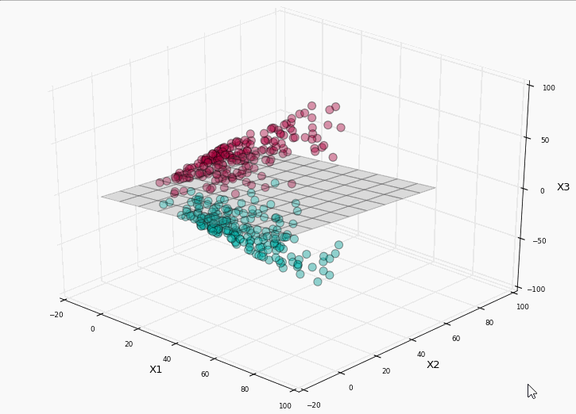

# TouchDynamics
### Touch Dynamics Biometrics test on 4 State of Art datasets<br>
<p align="center">
  
</p>

### Index

- [**What is TouchDynamics?**](#what-is-touch-dynamics)
- [**System Dependencies**](#requirements-and-dependencies)
- [**Quick Start**](#quick-start)
- [**Classifiers**](#classifiers)
- [**Credits**](#credits)

<ul>
<li>

## What is Touch Dynamics?

**TouchDynamics** is project developed for a "Biometric systems" exam 
at **Aldo Moro University** of Taranto Italy. <br>
its goal is to replicate and test best and most popular classifiers on State of Art datasets. 
It is tested on 4 different datasets, 2 are datasets of Keystrokes, 2 are datasets of swipes. <br>
1 - TouchAnalytics [58] (Swipes) <br>
2 - BioIdent [70]   (Swipes) <br>
3 - The Mobikey [31]    (Keystrokes) <br>
4 - Weka Arff [68]  (Keystrokes) <br>

</li>
<li>

## Requirements and Dependencies
```
(Tested on Python on 3.7)
pandas~=1.0.5
scikit-learn~=0.24.2
utils~=1.0.1
Keras~=2.3.1
matplotlib~=3.3.3
numpy~=1.19.4
scipy~=1.7.0
joblib~=0.14.1
sklearn~=0.0
imblearn~=0.0
seaborn~=0.10.1
joblib~=0.14.1
keras~=2.3.1
tensorflow~=1.15.0
 ```

</li>
<li>

## Quick Start

1 Install requirements with: pip install -r requirements.txt <br>
2 Open src/"Dataset Name"/ execute:<br>
→ NN_"Dataset Name".py for Neural Network test<br>
→ RF_Knn_SVM_"Dataset Name".py for Shellow learning test<br>
- NB: Internet Connection is required to install dependencies

</li>
<li>

## Classifiers

<li>
    Random Forest <br>
    Collection classifier obtained from the bagging of decision trees.
    Random forests are a solution that minimizes the overfitting of 
    the training set with respect to decision trees.
    <p align="center">
        
    </p>
</li>
<li>
    kNN <br>
    Object classifier based on the features of objects close to the one considered.
    The INPUT consists of the k closest training examples in the functionality space.
    The OUTPUT is a membership in a class.
    An object is classified by a plurality vote of its neighbors, with the object 
    assigned to the most common class among its k closest neighbors.
    If k = 1, the object is simply assigned to the class of that single closest neighbor.
    <p align="center">
        
    </p>
</li>
<li>
    SVM <br>
    Represent the examples as points in space so that they are separated by as 
    large a space as possible.
    The new examples will be predicted based on the space / category in which they fall.
    If not linear, the SVM carries out the classification using the kernel method,
    implicitly mapping their inputs in a space of multi-dimensional features.
    <p align="center">
        
    </p>
</li>
<li>
    Neural Network <br>
    A feed-forward neural network is an artificial neural network where connections 
    between units do not form loops, differentiating themselves from recurrent neural networks.
    In this neural network, information only moves in one direction, forward,
    with respect to entry nodes, through hidden nodes (if any) to exit nodes.
    Feed-forward networks do not have input memory that occurred in previous times, 
    so the output is determined only by the current input.
    <p align="center">
        
    </p>
</li>

<li>

## Instructions

#### Custom settings for testing
- Parameters for: **Neural Networks**:
```
    EPOCHS = 10
    NODES = 300
    Test_Size = 0.1
    Strategy = 'OverSampler'  # 'UnderSampler'
 ```
- Parameters for: **Random Forest / kNN / SVM**:
```
    "Parametri Generali "
    Test_Size = 0.1
    NFold = 3
    Strategy = 'UnderSampler' # 'OverSampler' 

    "Knn"
    n_neighbors = 3

    "Random Forest"
    n_estimators = 100          # [10, 20, 30, 100]
    randomization = "sqrt"      # ["sqrt", "log2"]
    bootstrap = 0.5             # [0.5, 0.6, 0.7, 0.8, 0.9]
 ```
→ Execute the ".py" to lunch the test

#### Almost each dataset contains a 'Feature_extractor script' to obtain features from raw_data <br>
- TouchAnalytics (Matlab script: "extractFeaturesFIX.m" ) <br>
- The Mobikey (Python Script: "Mobikey_feature_extractor.py") <br>
- BioIdent (Python Script: "BioIdent_feature_extractor.py") <br>
- WekaArff (No Script. Extracted from Original Paper) <br>
- DG150 (Python Script (Not Used): "DG150_feature_extractor_(non_usato).py") <br>
</li>
<li>

### Credits

**Developed by:**

[**Chrism1c**](https://github.com/Chrism1c)

</li>
</ul>
